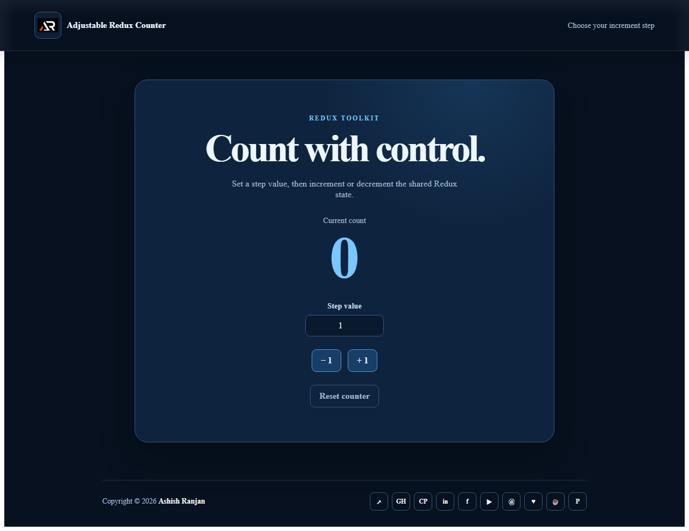

# Adjustable Redux Counter

A responsive React counter powered by Redux Toolkit. Set the step value, then increment or decrement the shared count by that amount.

## Features

- Adjustable increment and decrement step
- Redux Toolkit slice and store structure
- Reset control for count and step state
- Accessible numeric input and button labels
- Fixed branded header, responsive card and icon-only footer links

## Tech Stack

React, Redux Toolkit, React Redux, Create React App, Sass and CSS Modules.

## Run locally

```bash
npm install
npm start
```

## Build and deploy

```bash
npm run build
npm run deploy
```

Live URL: [https://a2rp.github.io/react-redux-toolkit-counter-app/](https://a2rp.github.io/react-redux-toolkit-counter-app/)

## Preview



## Links

- [Portfolio](https://www.ashishranjan.net/)
- [GitHub](https://github.com/a2rp)
- [CodePen](https://codepen.io/ash1198)
- [LinkedIn](https://www.linkedin.com/in/aashishranjan)
- [Facebook](https://www.facebook.com/theash.ashish/)
- [YouTube](https://www.youtube.com/@ashishranjan-ashz?sub_confirmation=1)
- [Email](mailto:ash.ranjan09@gmail.com)

## Support

- [Support](https://a2rp-donation-page.netlify.app/)
- [Buy Me a Coffee](https://buymeacoffee.com/a2rp)
- [Patreon](https://patreon.com/a2rp)